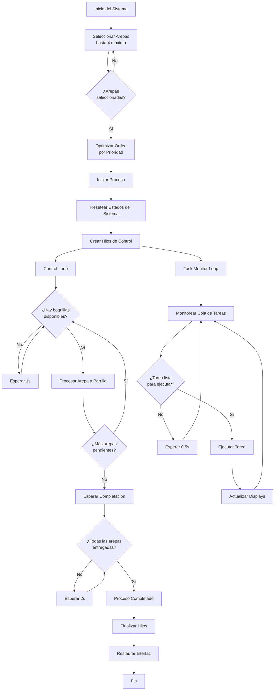
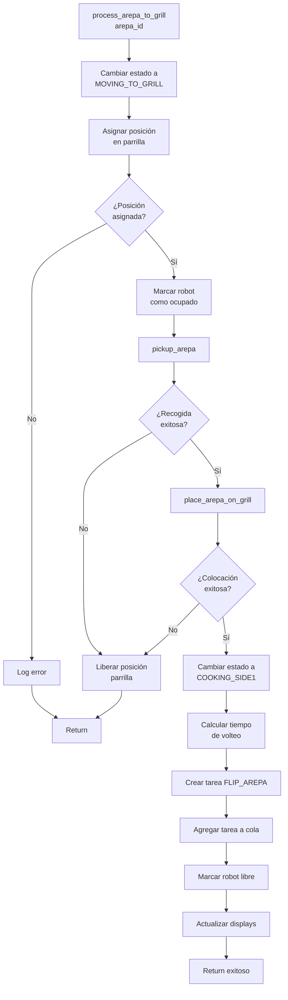
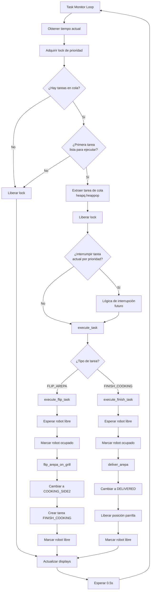
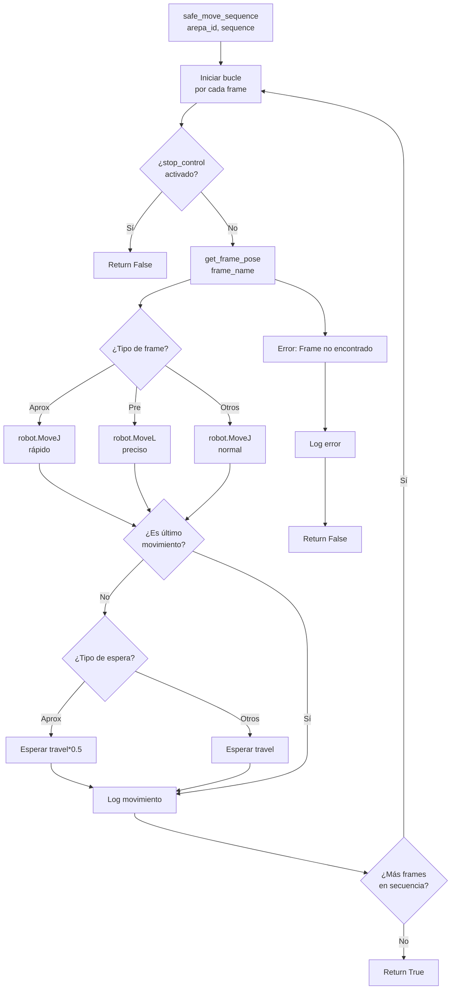

# 🤖 Automatización del Proceso de Preparación de Arepas

## 🌟 Resultados de Aprendizaje

Desarrollo de un sistema robotizado **simulado** para automatizar el proceso de preparación de arepas, desde la selección aleatoria en una vitrina hasta su cocción y entrega, usando herramientas como **RoboDK**, lógica de control por tareas y una interfaz HMI personalizada.

---

## 🛠️ Requisitos del Proyecto

* Simulación completa en **RoboDK**.
* Interfaz humano-máquina (HMI) en **Tkinter**.
* Lógica de selección y cocción por prioridades.
* Diseño de gripper electroneumático (modelo CAD incluido).
* Estantería (modelo BAGGEBO).
* Entrega simulada a posiciones de salida.

---

## 🍽️ Descripción del Problema

La elaboración manual de arepas en entornos industriales puede ser ineficiente, propenso a errores y riesgoso para la higiene. Este proyecto busca automatizar el proceso completo de preparación de arepas, incluyendo:

* Reducción del contacto humano.
* Cocción uniforme en ambos lados.
* Mayor eficiencia en la preparación y entrega.

---

## 🍔 Objetos Manipulados

* Arepas de distintos **tamaños, formas y prioridades**.
* Distribuidas aleatoriamente en 6 posiciones de estantería: `A1 - B3`.
* Parrilla de cocción con 4 posiciones: `1 - 4`.

---

## 🔧 Desarrollo del Gripper

Diseñado para adaptarse a distintas formas y pesos de arepas. Utiliza actuadores neumáticos con doble efecto y montaje modular en el extremo del robot.

**📸 Foto del gripper:**
``

**📐 Modelo CAD del gripper:**
``

**🔩 Gripper montado en el robot:**
``

---

## 🗃️ Alistamiento y Estructura de Trabajo

* Estantería tipo BAGGEBO con 6 arepas en posiciones aleatorias.
* Parrilla con 4 posiciones disponibles.
* Sistema de entrega automatizado con posiciones de salida.

**📸 Robot con estantería y arepas:**
``

---

## ⚙️ Proceso Automatizado

1. Selección de arepa desde la interfaz.
2. Toma desde la estantería.
3. Posicionamiento en parrilla libre.
4. Volteo tras tiempo estimado de cocción.
5. Entrega a recipiente final.

---

## 💻 Interfaz Gráfica (HMI)

* Permite selección de hasta 4 arepas.
* Muestra estado de parrilla y entregas.
* Ajuste de velocidades y control de ejecución.

**📸 Captura de la interfaz HMI:**
``

---

## 🧠 Diagrama de Flujo

### Proceso Principal Completo

### Función arepa a la estufa

### Sistema de colas de Tareas

### Secuencias de movimiento del Robot

---

## 💾 Código Fuente

> Proyecto desarrollado en Python utilizando la API de RoboDK y GUI en Tkinter.

* Estados definidos: `IDLE`, `SELECTED`, `COOKING`, `FLIPPING`, `DELIVERED`, etc.
* Manejo de tareas programadas con prioridad (heapq).
* Control seguro de movimiento entre "frames" predefinidos.
* Funciones dedicadas: `pickup_arepa()`, `flip_arepa_on_grill()`, `deliver_arepa()`.
* Optimiza el orden de procesamiento según prioridad y tiempo de cocción.

**🔗 Ver código completo:** [proyecto\_arepas.py](ruta/a/github)

---

## 🎥 Video del Proyecto

* Simulación completa en RoboDK con trayectorias.
* Explicación del funcionamiento del gripper y la interfaz.
* [🔗 Ver video](https://...)

---

## 📌 Consideraciones Finales

* Todo el desarrollo fue realizado en simulación.
* Se documenta el sistema como si estuviera listo para implementación real.
* Se priorizó la lógica modular y la adaptabilidad del sistema.

---

**Autores:** \[Nombres del equipo]
**Curso:** Robótica - 2025-I
**Universidad Nacional de Colombia**
